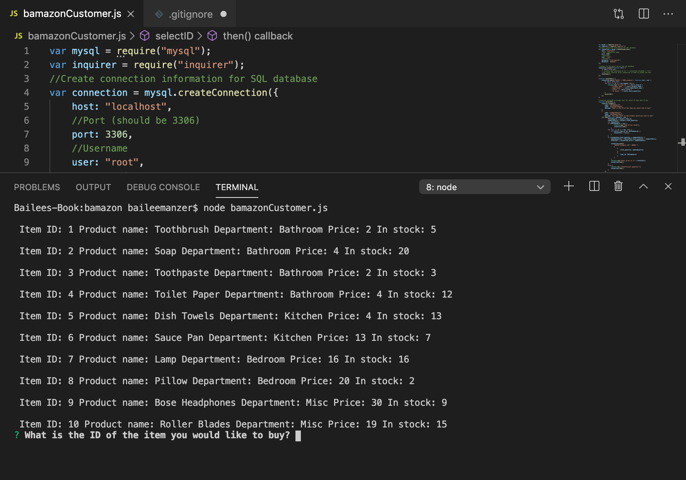
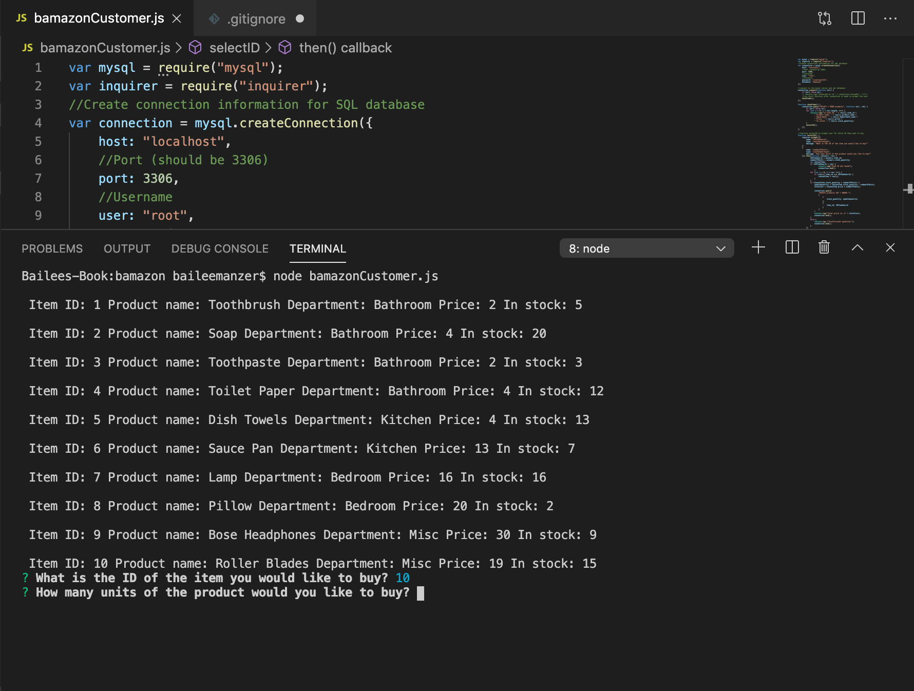

# bamazon
The bamazon app is an Amazon-like storefront using MySQL and Node. The app takes in orders from customers and depletes stock from the store's inventory (in the MySQL database). The customer is then alerted with their total price of their products based on which one they selected and how many they ordered. If an insufficient quantity is entered by the customer, the app will alert the customer of this mistake. 

## How to Guide
The command line will prompt the customer after they enter "node bamazonCustomer.js" into the terminal. The customer will automatically be shown the total inventory in the MySQL database and the items to choose from. The customer is then prompted to type which item they want with an ID. Next, they are prompted to type how many units they desire. Based on this collected information, the app will update the database with how much quantity of each item remains and lets the customer know their total cost. 

## SCREENSHOTS
Deployed App
Here is the link to the deployed applications--> https://baileemmanzer.github.io/bamazon/.

SCREENSHOT 1:

SCREENSHOT 2:

## Technologies Used
1. NODE
2. MYSQL
3. Inquirer NPM
4. Javascript
